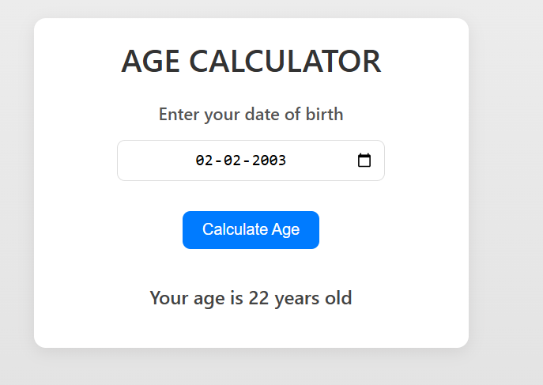

# 🎂 Age Calculator


# Age Calculator Web App

 

A clean, responsive web application that calculates your age based on your date of birth. Built with HTML, CSS, and JavaScript.

## Features ✨

- 📅 Date picker for easy birth date selection
- 🎯 Accurate age calculation (years only)
- 📱 Fully responsive design
- 🎨 Modern UI with smooth animations
- ⚡ Instant calculation on button click
- ❌ Input validation with user feedback

## Technologies Used 🛠️

- **Frontend**: HTML5, CSS3, JavaScript (ES6)
- **Styling**: CSS Flexbox, gradients, box shadows
- **Animations**: CSS transitions and transforms


## 🧑‍💻 Author

Made with ❤️ by **[Saeed Ullah]**  

## How to Use 🚀

1. Clone the repository:
   ```bash
   git clone https://github.com/your-username/age-calculator.git